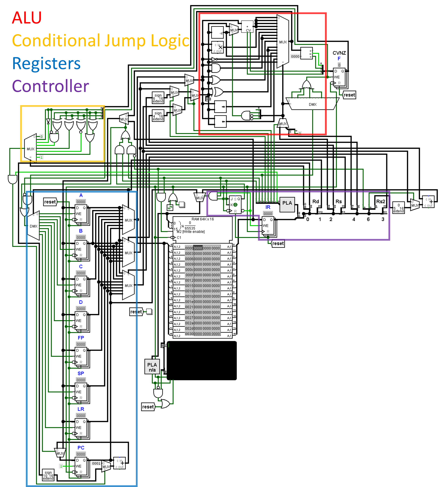

# bit16
## Repository for my toy CPU design "bit16"

Created a basic 16-bit CPU as an excercise

Included are the following:
- bit16 circuit file
- Image of the circuit
- Basic assembler and a (subset of) C compiler
- Documentation for the bit16 CPU

